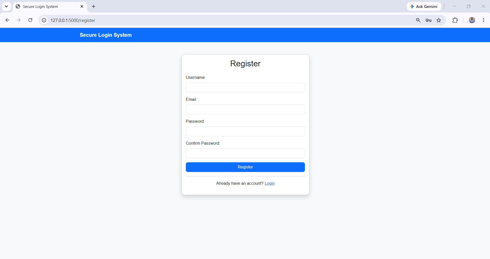
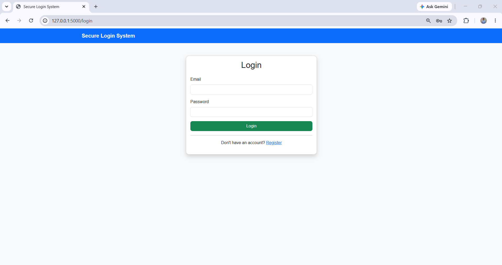
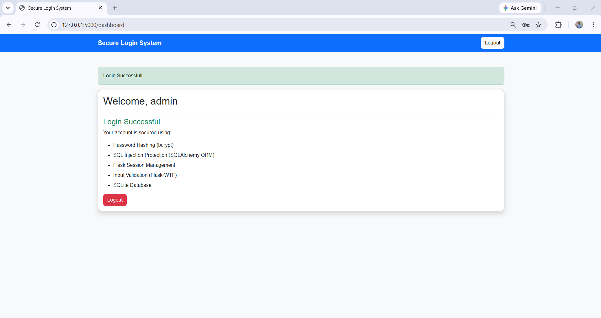

# 🔐 Secure Login System

A secure web application built using **Python Flask** that provides user registration and login with encrypted passwords, secure session management, input validation, and protection against SQL Injection.

---

## 📖 Project Overview

The Secure Login System is designed to provide a secure authentication mechanism for users. It uses **Bcrypt** to hash passwords before storing them in a SQLite database, ensuring that sensitive information is never stored in plain text.

The application also uses **Flask-Login** for session management and **Flask-WTF** for secure form handling and validation. SQLAlchemy ORM is used to interact with the database, protecting the application against SQL Injection attacks.

---

## ✨ Features

- 👤 User Registration
- 🔑 User Login
- 🔒 Password Hashing using Bcrypt
- 🛡️ SQL Injection Protection using SQLAlchemy ORM
- ✅ Input Validation with Flask-WTF
- 🔐 Secure Session Management using Flask-Login
- 🚪 Logout Functionality
- 💾 SQLite Database
- 🎨 Responsive User Interface with Bootstrap 5

---

## 🛠️ Technologies Used

- Python 3
- Flask
- Flask-Bcrypt
- Flask-Login
- Flask-WTF
- Flask-SQLAlchemy
- SQLite
- HTML5
- CSS3
- Bootstrap 5

---

## 📂 Project Structure

```
Secure_Login_System/
│
├── app.py
├── auth.py
├── config.py
├── forms.py
├── models.py
├── requirements.txt
├── README.md
├── .gitignore
│
├── static/
│   └── style.css
│
└── templates/
    ├── base.html
    ├── register.html
    ├── login.html
    └── dashboard.html
```

---

## ⚙️ Installation Guide

### 1. Clone the Repository

```bash
git clone https://github.com/nalawadeshravani202/Secure_Login_System.git
```

### 2. Open the Project Folder

```bash
cd Secure_Login_System
```

### 3. Create a Virtual Environment

```bash
python -m venv venv
```

### 4. Activate the Virtual Environment

**Windows**

```bash
venv\Scripts\activate
```

### 5. Install Dependencies

```bash
pip install -r requirements.txt
```

### 6. Run the Application

```bash
python app.py
```

### 7. Open in Browser

```
http://127.0.0.1:5000
```

---

## 🔒 Security Features

- Passwords are hashed using **Bcrypt**
- SQL Injection protection through **SQLAlchemy ORM**
- Secure user session management using **Flask-Login**
- Input validation using **Flask-WTF**
- Secure authentication workflow

---

## 📸 Project Screenshots

### Registration Page



---

### Login Page



---

### Dashboard



---

## 🧪 Testing

The application has been tested for:

- Successful User Registration
- Successful User Login
- Invalid Login Credentials
- Duplicate User Registration
- Password Hash Verification
- Session Login and Logout

---

## 🚀 Future Enhancements

- Two-Factor Authentication (2FA)
- Email Verification
- Password Reset via Email
- Remember Me Feature
- User Profile Management
- Admin Dashboard
- Account Lockout After Multiple Failed Login Attempts

---

### 👩‍💻 Author

**Shravani Nalawade**

- GitHub: https://github.com/nalawadeshravani202
- LinkedIn: https://www.linkedin.com/in/shravani-sachin-nalawade-795b24322/

---

## ⭐ If you found this project useful, consider giving it a star.